# 业务流程图（升级版）

```mermaid
flowchart LR
    A[收盘后触发同步] --> B[拉取API数据\n行业+概念]
    B --> C{数据质量门控}
    C -- 失败 --> C1[标记 quality_failed\n记录原因+告警]
    C -- 通过 --> D[按 api_id+category_type 对齐（标准化）]

    D --> E{是否新板块}
    E -- 否 --> F[写入 daily_data（入库完成）\n进入待评分队列]
    E -- 是 --> G[标记 new_detected]
    G --> H[触发AI关联分析\n写入 pending suggestions]
    H --> I[用户确认/编辑/拒绝]
    I --> J[写入 relations\n板块状态->active]

    F --> K[运行评分引擎]
    J --> K
    K --> K1[计算 expected/deviation/cumulative]
    K1 --> L[生成预测结果\nrun_type=prod]
    L --> M[发布排行榜+图谱展示]

    M --> N[策略回测触发]
    N --> O[回测任务队列\nbacktest_jobs]
    O --> P[回测执行\nrun_type=backtest]
    P --> Q[回测报告\n命中率/alpha/明细]

    Q --> R[参数优化建议\nAI+人工]
    R --> S[配置保存（版本化）]
    S --> K

    C1 --> T[系统监控面板\n最后同步日/失败率/耗时]
    Q --> T
    S --> T
    T --> U[发布准备与运行保障\n发布前检查+运行手册]
    U --> V[发布后运行观察与收官验收\n基线监控+证据归档]
    V --> W[收官归档与维护交接\n归档清单+维护模式]
    W --> X[维护模式（回归巡检）\n周期巡检+异常回归]

    subgraph LG[阶段颜色图例]
        LG1[已完成]
        LG2[进行中]
        LG3[待开始]
    end

    classDef done fill:#dcfce7,stroke:#16a34a,stroke-width:2px,color:#14532d;
    classDef doing fill:#fef9c3,stroke:#ca8a04,stroke-width:2px,color:#713f12;
    classDef pending fill:#e2e8f0,stroke:#64748b,stroke-width:1.5px,color:#334155;

    class A,B,C,C1,D,E,F,G,H,I,J,K,K1,L,M,N,O,P,Q,R,S,T,U,V,W done;
    class X doing;
    class LG1 done;
    class LG2 doing;
    class LG3 pending;
    style LG fill:transparent,stroke:#94a3b8,stroke-dasharray: 5 5
```

## 说明
- 这是“面向实现”的流程图，重点体现了：
  - 生产评分与回测评分隔离（`run_type=prod/backtest`）
  - 新板块状态流转（`new_detected -> ai_pending -> active`）
  - 数据质量门控在评分前
  - 参数优化闭环（回测 -> 优化 -> 重新评分）
- 当前阶段锁位置：
  - 已完成：`A -> W`（含 `S -> K` 回灌闭环、UI 基线、监控可见性固化、发布前检查、发布后观察、收官归档）
  - 进行中：`X`（维护模式-回归巡检）
  - 前端阶段锁：已切换到 `维护模式（回归巡检）`
